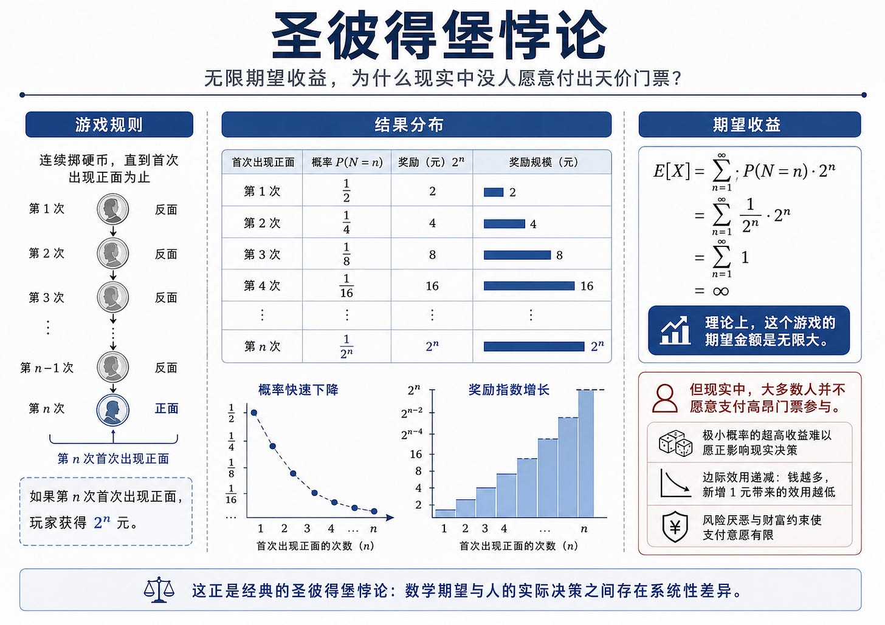
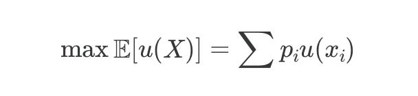
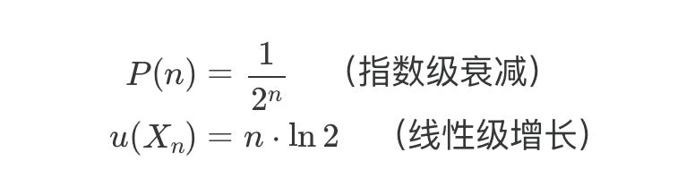
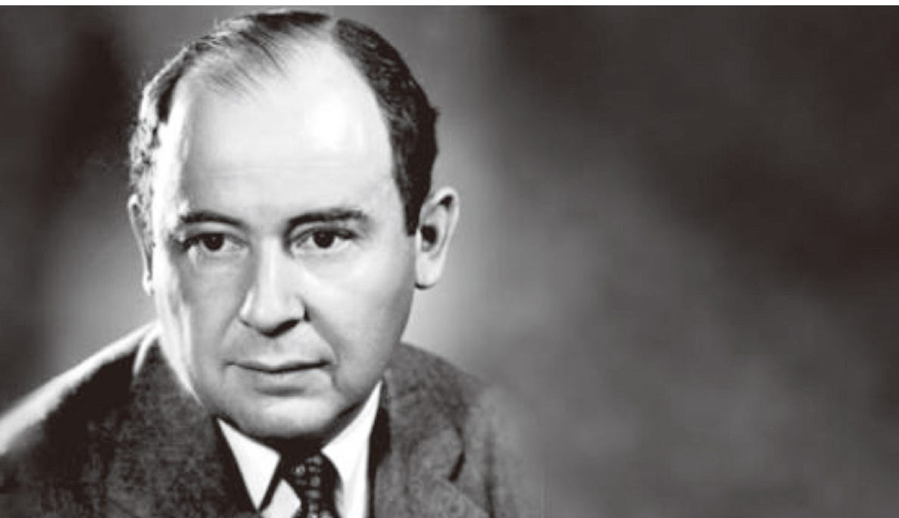
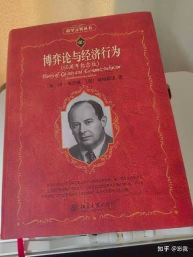
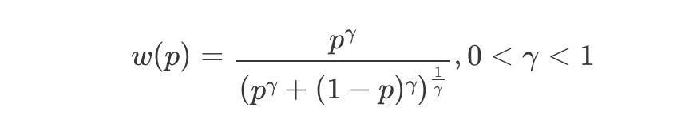
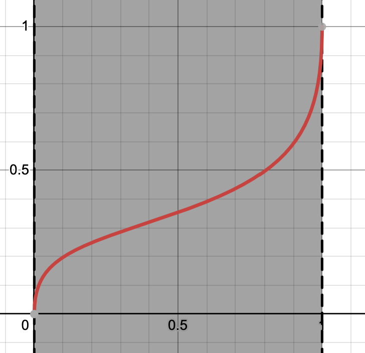
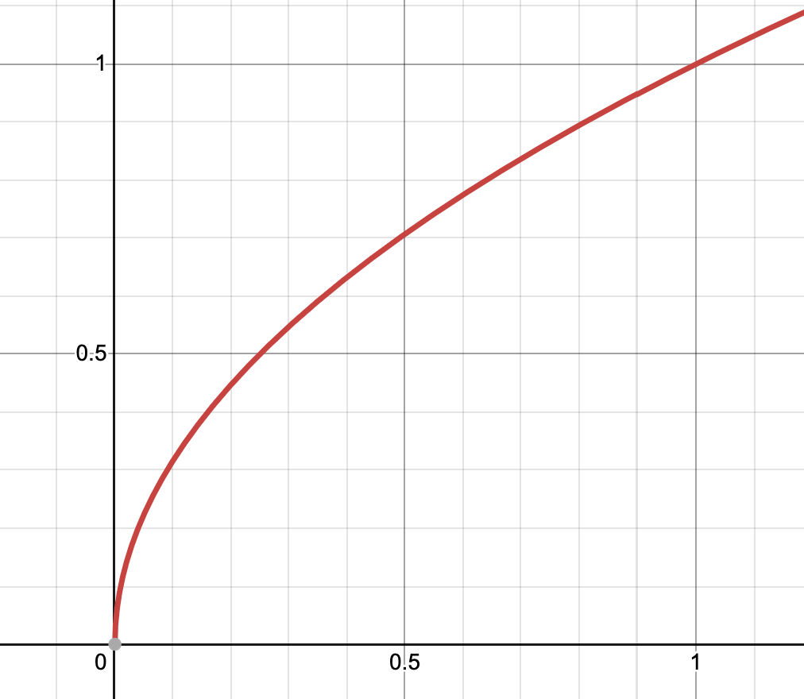

<!-- wordm:lang zh -->

在看强化学习，几乎围绕着奖励函数做文章，构建了大名鼎鼎的贝尔曼方程，围绕着贝尔曼方程设计动态规划方法，包括策略和价值迭代，TD- Learning，Q-Learning等等。

但是奖励函数为什么设计呢？事情追溯到30年代一代数学大师冯诺伊曼参与的博弈论。

## 期望效用

早在18世纪，伯努利就用圣彼得堡悖论表明数学期望是无法表达人们的真实决策的。

所以提出了以**效用**代替收益，效用是经过心理处理的概念。

伯努利的做法是以对数函数 $u(x)=\ln(x)$ 代替直接的收益，

最后结果是有限的 $2\ln 2$ 约等于 1.38，刚好等于第二次投掷的直接效用。

这个理论是基于心理学假设和期望求和而改造出来的，在20世纪初，微观经济学家们摒弃这种做法，认为人们没有一个标量去衡量所有事物的效用，更不会按概率求和去求出期望效用。

直到冯诺伊曼和他的博弈论横空出世。

## vNM效用理论

博弈论需要定义可比较的量，才能设计策略。但是人们只会比较事物，哪里有一个数值来衡量他的感受呢？冯诺伊曼证明，只要满足一组公理，就能把偏好之间的比较转换为期望效用之间的比较，所以选择最偏好的选项，就变为选择期望效用最大的选项。

**vNM四大公理（冯诺伊曼-摩根斯坦）**

1. 完备性：任何事物可比较
2. 传递性：**不**存在三角克制关系
3. 连续性：支持线性插值，三个事物有偏好顺序的时候，中间事物等于另外两个的某个比例的中和
4. 独立性：事物之间互不影响，两个事物在比较的时候，双方各自加入同一个事物也不影响比较结果

## 期望效用的缺陷

[阿莱悖论](https://zh.wikipedia.org/wiki/%E9%98%BF%E8%8E%B1%E6%82%96%E8%AE%BA) 讲了期望、效用和主观感受的差异。比如，给你二选一，两个选择的结果是金钱，数额都很大，二者差了数倍，但是确定性也差了很多，一个钱少但（几乎）百分比确定，一个钱多但只有1/10可能。那么你怎么选？

假如按照传统经济学理论，纯粹是风险厌恶在调节二者的效用，就选钱多的。

那么继续做实验，还是二选一，一个金钱多得多，但是风险也大一点，测试者反而会选择风险更大的。

风险厌恶理论无法解释这个现象。

## 前景理论

有一种建模方式是前景理论（Prospect Theory），由丹尼尔·卡尼曼（Daniel Kahneman，《思考，快与慢》作者）和阿莫斯·特沃斯基（Amos Tversky）于 1979 年提出的行为经济学核心理论，有四个机制颠覆传统经济学理论：

- **参照点依赖（Reference Dependence）**：人们评估一件事情是好是坏，看的不是最终财富的绝对值，而是**相对于“参照点”是赚了（Gain）还是亏了（Loss）**。
- **损失厌恶（Loss Aversion）**：**损失带来的痛苦感，远大于等额收益带来的快乐感。** 实验表明，丢掉 100 块钱的痛苦程度，大约需要捡到 225 块钱的快乐才能平复（损失厌恶系数约为 2.25）。
- **敏感度递减（Diminishing Sensitivity）**：财富变动的边际心理感知是递减的。从 0 变成 100 块感受极其明显，但从 10,000 变成 10,100 块，心理波澜就很小了。
- **非理性概率加权（Probability Weighting）**：人们在心理上会**高估极小概率事件**（例如买彩票、买航空险），同时**低估中高概率事件**。

具体到这个阿莱悖论，心理上的价值是

其中，$w(p)$ 是人们对概率的主观感受，$v$ 是对效用的主观感受

这是 $\gamma=0.5$ 的时候的 $w(p)$，可以看到在首尾的斜率很高，加速趋近。

$v(x)$ 取一个边际递减的函数比如

## 未完待续

<!-- wordm:lang end -->
