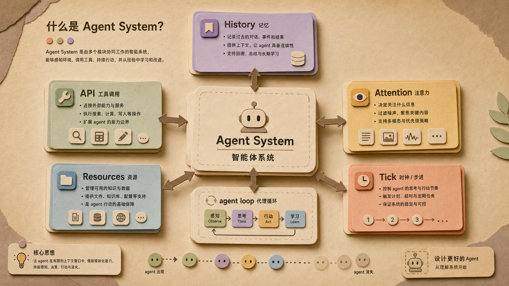
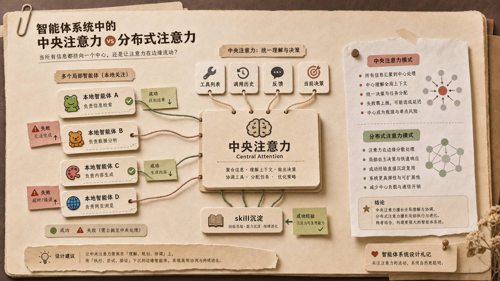
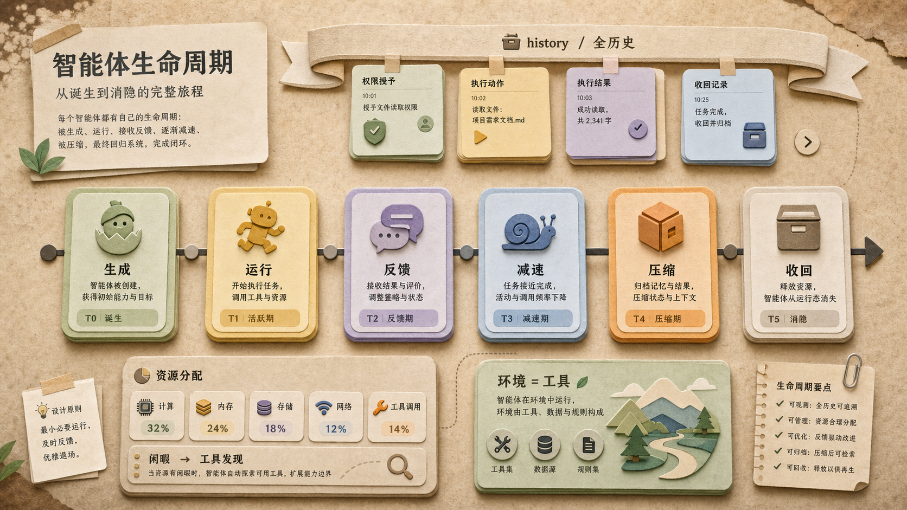

<!-- wordm:lang zh -->

一个应用放一个 agent system。这个 system 本身也是一个工具，也可能是一个 agent。它向主 agent 暴露 API，让主 agent 借助它生成更多 agent，去补足人和环境互动时缺少的工具。

系统的产出不是一个孤立的 agent，而是一个 agent loop：能感知、调用工具、行动、接收反馈、继续学习，也能在资源不足或反馈消失时减速、压缩、被收回。

::: {.callout-note appearance="simple"}
真正关键的不是“生成子代理”，而是资源分配、通信协作、历史、注意力、tick 与感知、agent 的存在与消亡。
:::

::: {.callout-note appearance="simple"}
系统应该接收模糊需求，而不只接收结构化需求。它要能推测“你可能会喜欢这样”，并据此创造合适的 agent。
:::

*Agent System 不是一个生成按钮，而是一套让 agent loop 出生、协作、学习和收回的环境。*

## 权限、API 和必要的绕过

主 agent 应该尽量通过系统暴露的 API 修改系统，而不是直接修改底层代码。API 是系统和主 agent 之间的礼貌边界，也是可追踪、可审计的入口。

但最后仍然需要一个强力 API，让主 agent 可以在预测到 API 不足、或者 API 路径消耗更多资源时，绕过常规路径直接改底层。绕过应该被资源惩罚，修改完成后再补充新的 API，把例外沉淀成制度。

## 历史让系统像环境，而不是工具调用器

Agent system 的意义在于拥有历史：它知道每个 agent 如何被创建，获得了什么权限，做过什么，什么时候减速，什么时候被收回。

例如，创建 agent a，约定它能阅读一个文件夹，并能编辑某些文件；再创建 agent b，给它几乎一样的权限，只是不能编辑。系统需要保留这些差异，因为这些差异就是环境的记忆。

## 注意力：谁来接收子代理的信息

人会要求生成子代理，是因为注意力分身乏力；但 system 本身也会分身乏力。它产出 agent 后需要告诉你，可问题是：你又用谁来接收这些信息？

注意力接近于组装上下文：工具列表、工具调用历史、子 agent 的反馈、当前需要做决定的信息。判断力可以集中给中央注意力，也可以让模块子 agent 带着分布式注意力；地方失败多次后提交中央，中央解决后再把方法下沉成 skill。

*中央注意力负责理解、规划和协调；地方经验在失败后上报，解决后沉淀成可复用 skill。*

## Tick、感知、资源与闲暇

tick 是为了应付快速变化。监控界面的 agent 需要 tick，因为它要感知变化、发现异常、决定是否通报。但监控界面是否真的需要是 agent，也值得怀疑：如果它只是机械传递变化，那么它到底需要什么决策？

资源分配也需要一个 agent。它面对的是数字，但这些数字从哪里来、数学如何构建，仍然没有说清楚。当多余资源没有分配出去，这也许就是闲暇：注意力收缩到少量工具，尝试组合工具、发现 pattern、抽象出新工具。

*低能耗不是静止，而是压缩。没有反馈的 agent 会减速，和被遗弃工具相关的 agent 会自然受损并被系统收回。*

## 环境、个人 agent 与“家”

LLM 可能承接了很多先验，但真正要构建意识循环，还缺环境。环境不就是工具吗？更现实的顺序是先搭建基础环境，再让 agent 去探索和拓展环境。

平台不是单个工具，而是一个有分发能力的环境。用户可以付费下载，也可以由他的个人 agent 决定下载。环境里的 agent 行为更符合用户喜好，个人 agent 也因此增长经验。

每个人都想要一个专属于自己的世界。这个世界不只是 3D 行走器，而是能容纳多种模态的编排，也能容纳其他环境。它是入口，也是回顾的地方，也是收集信息的地方。这不就是家吗。

App 的位置也由此变得清楚：app 是从这个世界里抽出的核心体验，是对复杂环境的一次抽象和压缩。

<!-- wordm:lang end -->

English translation

<!-- wordm:lang en -->

Each application can hold one agent system. The system itself is a tool, and may also be an agent. It exposes APIs to the main agent, letting that agent create more agents when humans lack tools for interacting with the environment.

The output is not an isolated agent, but an agent loop: it can perceive, call tools, act, receive feedback, keep learning, and also slow down, compress, or be reclaimed when resources or feedback disappear.

::: {.callout-note appearance="simple"}
The core is not simply “creating subagents,” but resource allocation, communication, history, attention, ticks and perception, and the birth and disappearance of agents.
:::

::: {.callout-note appearance="simple"}
The system should accept vague needs, not only structured requirements. It should infer “you might like this” and create suitable agents from that imagination.
:::

*An agent system is not a generate button. It is an environment where agent loops are born, collaborate, learn, and get reclaimed.*

## Permission, APIs, and Necessary Bypass

The main agent should modify the system through exposed APIs whenever possible, rather than changing the underlying code directly. APIs form a polite boundary and a traceable, auditable entry point.

Yet the system still needs a powerful API that allows bypassing the normal route when the main agent predicts the existing APIs are insufficient or more costly. Bypass should carry a resource penalty; after the change, the system should add a new API so the exception becomes institution.

## History Makes the System an Environment

The meaning of an agent system is that it has history: it knows how each agent was created, what permissions it received, what it did, when it slowed down, and when it was reclaimed.

For example, agent A may read a folder and edit certain files; agent B may receive almost the same permissions but cannot edit. The system must retain these differences, because they are the memory of the environment.

## Attention: Who Receives the Subagents

Humans ask for subagents because attention cannot split indefinitely; the system has the same problem. After it creates an agent, it needs to report back, but who receives that information?

Attention is close to context assembly: tool lists, tool-call history, subagent feedback, and the current decision. Judgment can be centralized, or distributed to local agents; repeated local failure can be escalated to the center, then pushed back down as a skill after resolution.

*Central attention handles understanding, planning, and coordination; local experience escalates after failure and returns as reusable skills.*

## Ticks, Perception, Resources, and Idle Time

Ticks handle rapid change. A monitoring agent needs ticks because it perceives changes, detects anomalies, and decides whether to report. But it is worth questioning whether every monitor must be an agent: if it merely relays changes mechanically, what decision does it make?

Resource allocation also needs an agent. It faces numbers, but where the numbers come from and how the math is constructed remain open. When spare resources are unallocated, perhaps that is idle time: attention narrows to a few tools, combines them, discovers patterns, and abstracts new tools.

*Low energy is not stillness, but compression. Agents without feedback slow down; agents tied to abandoned tools degrade and are reclaimed.*

## Environment, Personal Agents, and Home

LLMs may carry many priors, but to build a loop of consciousness, an environment is still missing. Is an environment not made of tools? A more realistic order is to build the base environment first, then let agents explore and expand it.

A platform is not a single tool, but an environment with distribution. Users may pay to download, or their personal agents may decide to download. Agents in the environment behave more in line with user preferences, and the personal agent gains experience in return.

Everyone wants a world of their own. This world is not just a 3D walking space; it can orchestrate many modalities and contain other environments. It is an entrance, a place of review, and a place to collect information. Is that not home?

The role of an app becomes clear: an app extracts a core experience from this world. It is an abstraction and compression of a complex environment.

<!-- wordm:lang end -->

